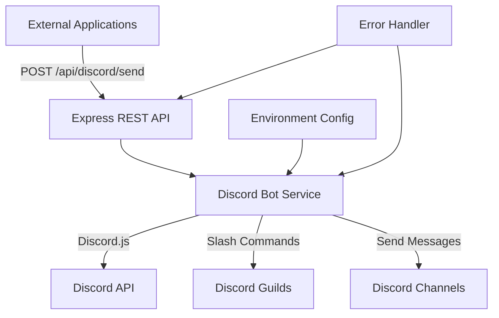

# Discord Bot Backend Design Document

## Overview

The Discord bot backend will extend the existing Express.js application to include Discord.js integration. The system will run both the existing web API and Discord bot functionality in a single process, providing REST endpoints for external applications to send messages to Discord channels and register slash commands.

## Architecture

### High-Level Architecture



### Component Integration

The Discord bot will be integrated into the existing Express application structure:
- Discord bot initialization will occur alongside the existing MongoDB connection
- Discord routes will be added under `/api/discord/` namespace
- Shared error handling and logging will be used across both systems

## Components and Interfaces

### 1. Discord Bot Service (`services/discordBot.js`)

**Purpose**: Core Discord.js client management and command handling

**Key Methods**:
- `initializeBot()`: Initialize Discord client with token and event handlers
- `registerSlashCommands(commands)`: Register slash commands with Discord API
- `sendMessage(channelId, content)`: Send message to specific channel
- `validatePermissions(channelId)`: Check bot permissions for channel access

**Events Handled**:
- `ready`: Bot connection established
- `interactionCreate`: Slash command interactions
- `error`: Connection and API errors

### 2. Discord Controller (`controllers/discordController.js`)

**Purpose**: Handle HTTP requests for Discord operations

**Endpoints**:
- `POST /api/discord/send`: Send message to Discord channel
- `POST /api/discord/commands/register`: Register new slash commands
- `GET /api/discord/guilds`: List available guilds
- `GET /api/discord/channels/:guildId`: List channels in guild

**Request/Response Format**:
```javascript
// Send Message Request
{
  "channelId": "123456789012345678",
  "content": "Hello Discord!",
  "embeds": [] // optional
}

// Response
{
  "success": true,
  "messageId": "987654321098765432",
  "timestamp": "2024-01-01T12:00:00Z"
}
```

### 3. Discord Routes (`routes/discordRoutes.js`)

**Purpose**: Define REST API endpoints and middleware

**Middleware Stack**:
- Authentication validation
- Request body validation
- Rate limiting
- Error handling

### 4. Command Handler (`handlers/commandHandler.js`)

**Purpose**: Process slash command interactions

**Command Structure**:
```javascript
{
  name: 'ping',
  description: 'Replies with Pong!',
  execute: async (interaction) => {
    await interaction.reply('Pong!');
  }
}
```

## Data Models

### Discord Configuration Model

```javascript
const DiscordConfig = {
  botToken: String,        // From environment
  applicationId: String,   // From environment
  guildIds: [String],     // Target guilds for commands
  defaultChannelId: String // Fallback channel
}
```

### Message Request Model

```javascript
const MessageRequest = {
  channelId: {
    type: String,
    required: true,
    validate: /^\d{17,19}$/ // Discord snowflake format
  },
  content: {
    type: String,
    maxLength: 2000
  },
  embeds: [{
    title: String,
    description: String,
    color: Number,
    fields: [{
      name: String,
      value: String,
      inline: Boolean
    }]
  }]
}
```

### Command Registration Model

```javascript
const SlashCommand = {
  name: {
    type: String,
    required: true,
    validate: /^[\w-]{1,32}$/
  },
  description: {
    type: String,
    required: true,
    maxLength: 100
  },
  options: [{
    name: String,
    description: String,
    type: Number, // Discord application command option types
    required: Boolean
  }]
}
```

## Error Handling

### Error Categories

1. **Discord API Errors**
   - Rate limiting (429)
   - Invalid permissions (403)
   - Resource not found (404)
   - Invalid request format (400)

2. **Bot Connection Errors**
   - Authentication failures
   - Network connectivity issues
   - Gateway disconnections

3. **Validation Errors**
   - Invalid channel IDs
   - Message content too long
   - Missing required fields

### Error Response Format

```javascript
{
  "success": false,
  "error": {
    "code": "CHANNEL_NOT_FOUND",
    "message": "The specified channel does not exist or bot lacks access",
    "details": {
      "channelId": "123456789012345678",
      "timestamp": "2024-01-01T12:00:00Z"
    }
  }
}
```

### Error Handling Strategy

- **Graceful Degradation**: Continue serving other requests when Discord is unavailable
- **Retry Logic**: Implement exponential backoff for rate-limited requests
- **Logging**: Comprehensive error logging with context and stack traces
- **User Feedback**: Clear error messages for API consumers

## Testing Strategy

### Unit Tests
- Discord service methods (mocked Discord.js client)
- Controller request/response handling
- Validation functions
- Error handling scenarios

### Integration Tests
- Full request flow from REST API to Discord
- Slash command registration and execution
- Error propagation through middleware stack

### Test Environment Setup
- Mock Discord bot for testing
- Test guild and channels
- Isolated test database for user data

## Security Considerations

### Authentication
- API key validation for REST endpoints
- Bot token security (environment variables only)
- Request origin validation

### Rate Limiting
- Implement rate limiting per API key
- Respect Discord's rate limits
- Queue management for high-volume requests

### Input Validation
- Sanitize all user inputs
- Validate Discord snowflake IDs
- Prevent injection attacks in message content

## Configuration Management

### Environment Variables

```bash
# Discord Configuration
DISCORD_BOT_TOKEN=your_bot_token_here
DISCORD_APPLICATION_ID=your_application_id_here
DISCORD_DEFAULT_GUILD_ID=your_guild_id_here

# API Configuration
DISCORD_API_KEY=your_api_key_here
DISCORD_API_RATE_LIMIT=100 # requests per minute

# Existing configuration remains unchanged
MONGODB_URI=mongodb://localhost:27017/auth_db
PORT=3000
```

### Startup Sequence

1. Load environment variables
2. Initialize MongoDB connection (existing)
3. Initialize Discord bot connection
4. Register slash commands
5. Start Express server with Discord routes
6. Log successful initialization

## Performance Considerations

### Connection Management
- Single Discord client instance
- Connection pooling for HTTP requests
- Graceful shutdown handling

### Caching Strategy
- Cache guild and channel information
- Store command registration status
- Implement TTL for cached data

### Monitoring
- Track message send success rates
- Monitor Discord API response times
- Log connection stability metrics